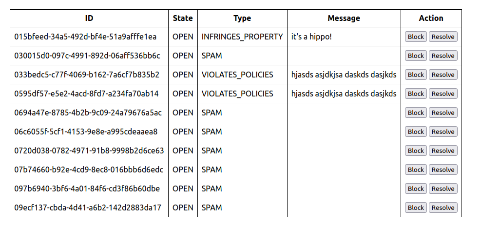

## Spam incident reporting tool

### Summary
The application in the repository provides a simple implementation for human verifications of reported spams with the below front-end interface:



The application can be split into three different components:

1. **Database (MongoDB):** Responsible for storing data related to reported spam incidents.

2. **Backend (FastAPI):** Provides RESTful APIs for interacting with the database and handling the verification process.

3. **Frontend:** A user interface that allows users to report spam incidents and provides an interface for human verification.

### Setup
The entire application is dockerized, making it relatively easy to start. Minimal prework is needed to set up and run the application:

1. **Set up the enviroment variables**: In the root folder, an `.env` file is needed with all the required environment variables. Here's an example:

```bash
DB_PORT_OUT=27017
DB_PORT_IN=27017

MONGO_HOST="mongo-db"
MONGO_ROOT_USER="root"
MONGO_ROOT_PWD="password"

API_HOST="0.0.0.0"
API_PORT_OUT=8080
API_PORT_IN=8080

REACT_APP_PORT_IN=3000
REACT_APP_PORT_OUT=3001
```

2. **Run the application:** Once the right environment variables are set, navigate to the root folder of the project where the `docker-compose.yml` file is located, and run the following command in your terminal:


```bash
docker-compose up
```

**Note**: All code is attached to the given service as a volume, which makes development easier by providing hot reload functionality without the need for a restart.

### Available endpoints
For additional functionality, several endpoints have been developed, which can be integrated later into the frontend to enhance its usability. The full documentation is available on Swagger, at http://{{host}}:{{port}}/docs, once the API is running, but some examples are also provided here.

```
@host = localhost
@port = 8080

###

http://{{host}}:{{port}}/ping

###

http://{{host}}:{{port}}/health

###

http://{{host}}:{{port}}/reports

####

http://{{host}}:{{port}}/reports?skip=4&sort_by=createde&page_size=3&q={"source":"REPORT","state":"OPEN"}

####

http://{{host}}:{{port}}/reports?skip=4&sort_by=createde&page_size=3&q={"id":"0103e005-b762-485f-8f7e-722019d4f302"}

####

PUT http://{{host}}:{{port}}/reports/0103e005-b762-485f-8f7e-722019d4f302
content-type: application/json

{
  "ticketState": "OPEN"
}
```